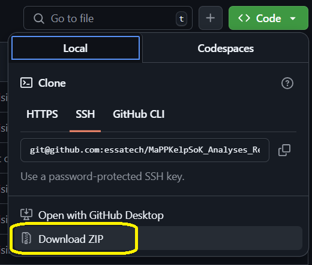

# Readme: MaPP State of Kelp Analysis Examples

## Repository title and description

* **Project Name**: MaPP State of Kelp Report
* **Purpose of this repository**: This repository contains example analysis pipelines and report card generation from RMarkdown templates.
* **Brief description**: The purpose of this repository is to provide example analysis pipelines for quadrat, UAV, and other data types. These analysis pipelines were introduced in ESSA's State of Kelp Report (Tamburello et al. 2025). This repository also includes report card templates in RMarkdown; these templates were designed to read in example data sheets, compile and analyze the data, and present the results in flexible outputs that can be catered to different audience types. 

## Cloning and using this repository

All analyses are written in the **R statistical language**.
Analysis pipelines use a variety of R packages for data compilation, analysis, and reporting. 
Each individual 

**To download the repository** to your local computer, you can download the repository as a .zip file by clicking the green "<> Code" button above and selecting "Download ZIP". 



If you have git installed on your computer, you can clone the repository with the following command: 

```
git clone https://github.com/essatech/MaPPKelpSoK_AnalysesReportcards.git
```

## Contents of the repository

This repository includes five subdirectories, each of which contains example analysis that could be extended to all MaPP sub-regions to mobilize monitoring data. 
**MaPP data are not included in this repository; analysis pipelines will need to be revised to include file paths to data files saved on your computer.**

Below, we describe the directory structure and a brief description of each file in this repository. 

### Data compilation and example analysis of MaPP monitoring data

* **Abiotic Data - Compilation and Analysis** includes data compilation and analysis scripts related to abiotic data, including lighthouse and CTD logger data. This folder also includes a compiled .csv of lighthouse derived data for temperature and salinity from 2019-2024.
    - *ClimateProjExtraction.R*: This R script contains code for extracting future climate condions at MaPP sites. 
    - *CTDDataCompilationNVI.R*: This script contains code for reading and tidying data collected from CTD Loggers by the MaPP kelp monitoring program in NVI region.
    - *LightstationBCCompilation.R*: This script contains code for reading and tidying data from active BC lightstations in the MaPP region for the kelp monitoring program.
    - *MaPP_lightstation_temperature_salinity_data_2019-2024.csv*: A .csv file containing compiled temperature and salinity data from lighthouse stations from years 2019 to 2024.
* **Quadrat Data - Compilation and Analysis** includes data compilation and analysis scripts related to quadrat-level Tier 2 sampling. 
    - *KelpDataCompilationNVI_post2022.R*: This file programatically merges data files from different monitoring programs conducted in the North Vancouver Island region starting in 2022. Not all data from before 2022 could be automatically compiled in this script (before 2021, different Nations used different data formats that often varied between years; data from 2022 onward are standardized and more easily compiled and cleaned programmatically). Instead, this script compiles data from all Nations starting from 2022, and also includes data from the Wei Wai Kum First Nation from 2020 onwards (as these were in a relatively straight-forward format that could be easily incorporated in time for reporting).
    - *calculateBiomass_T2data.R*:This script takes spatial extent data produced by the script, *UAV Data - Compilation and Analysis > UAVSpatialMetricsCalculation* and combines these with Tier 2 data from MaPP sites in NVI. After combining the data, this script estimates biomass of the kelp beds based on morphometric relationships (see the 2025 MaPP Monitoring Report, Thompson 2025). The script includes functions to (1) calculate average stipe diameter per quadrat when measurements are input as strings of varying formats (e.g., "31, 23, 25" and "41 20 30") and (2) estimate kelp bed biomass for each of bull and giant kelps based on UAV-derived extent and surface metrics. 
* **Spatial Stratification** includes an R script which, given raster data on stressors believed to influence kelp presence and persistance (i.e., depth-attenuated fetch, summertime sea surface temperature, and likelihood of urchin occupancy), creates spatial stratification layers to inform future monitoring efforts. These analyses were completed for Haida Gwaii as an example sub-region.  
    - **
* **UAV Data - Compilation and Analysis**
    - *UAVSpatialMetricsCalculation.R*: This script processes spatial data related to Kelp habitat delineation from 2020 to 2024. It reads, cleans, and combines data from multiple years into a single dataset.

### Sub-regional and regional report card templates 

* **Report Cards**
    - The folder *eg_DataSheets* contains a single example datasheet for bull kelp. The sheet has been populated with fake data and fake site names. 
    - *renderAllCards.R*: This script renders the RMarkdown report card templates (listed below) and demonstrates how to modify the rendering call to (1) incorporate new data (assuming that the new data follow the format of the sheet contained in the *eg_DataSheets* folder) and (2) adapt the report card format for different audiences. This script renders two sub-regional report cards, one for internal use and another for public use, and a regional report card.
    - *subregional_exampleBullKelpReportCard.Rmd* is an RMarkdown template report card that is rendered by calling *renderAllCards.R*. This template creates a report card representing sub-region level data suitable for different audiences. Rendering this RMarkdown file creates an HTML-based report card, with the outputs depending on input parameters provided in *renderAllCards.R*, including the intended audience and the datasheet to be compiled and reported.  
    - *regional_exampleBullKelpReportCard.Rmd* is an RMarkdown report card that is rendered by calling *renderAllCards.R*. This template creates a report card representing region level data suitable for a public audience. Unlike sub-regional report cards, the regional report card is generated from fully simulated data (data were only available from the North Vancouver Island sub-region at the time the regional report card was generated).

#### How to generate report cards from data sheet templates


### Other folders

* **renv** contains files that allow for reproducibility. There are no files in this folder that will need to be modified. See the section below, *Installing required R libraries*, for instructions on how to automatically install and load R libraries that you would need to repeat the analysis and report card generation. 

## Installing required R libraries

These analyses have several libraries which are required dependencies.
The `renv` package was used to create a reproducible analysis environment, making it simple to install the same libraries and versions of those libraries as were used in generating the Stake of Kelp Report analyses. 

Once you have downloaded the repository by cloning or by downloading and extracting the .zip archive (see above), 
run `renv::restore()`, which uses the metadata contained in the **renv** folder to install exactly the same version of every package we used in the analysis. 

## License